# 🏪 AURA Retail OS v2.0 - Smart Kiosk Simulation

A comprehensive OOP project demonstrating **11 design patterns**, **concurrent transaction handling**, **real-time synchronization**, and **admin panel management** for an intelligent retail kiosk system.

## 🚀 Quick Start

### Installation
```bash
# Navigate to project directory
cd Code_1

# Run the application
python main.py
```

### First Run
1. **Kiosk Selection Screen** appears
2. Choose kiosk type:
   - 🍔 **Food Kiosk** - General purpose retail
   - 💊 **Pharmacy Kiosk** - Medical environment  
   - 🚨 **Emergency Relief** - Disaster zone supplies
3. Main application launches

### Admin Login
- Click **👨‍💼 ADMIN** button in header
- Username: `admin`
- Password: `admin123`

## 🎬 Working Simulation (Video Demo)

> Watch the full working simulation of the AURA Retail OS project:

[](https://drive.google.com/file/d/1yQeE_T2o5z1s8JNOJ5a21njQ_M7dS7rt/view)

🔗 **[Click here to watch the project demo video](https://drive.google.com/file/d/1yQeE_T2o5z1s8JNOJ5a21njQ_M7dS7rt/view)**

---

## 📸 Screenshots

### 🖥️ Kiosk Selection Screen
> Choose your kiosk type on startup — Food, Pharmacy, or Emergency Relief.

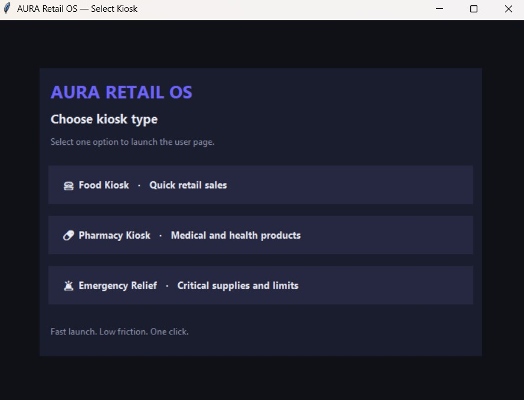

---

### 🛒 Customer View — Main Kiosk Interface
> The customer-facing screen with product cards, quick purchase panel, and live event log.

| Startup (Empty Log) | After Purchase |
|---|---|
|  | 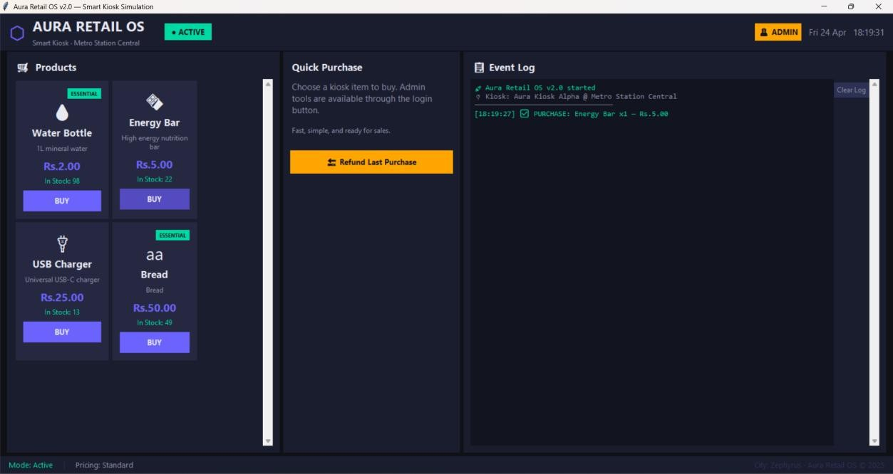 |

| Price Updated by Admin | Low Stock & Reorder Alerts |
|---|---|
| 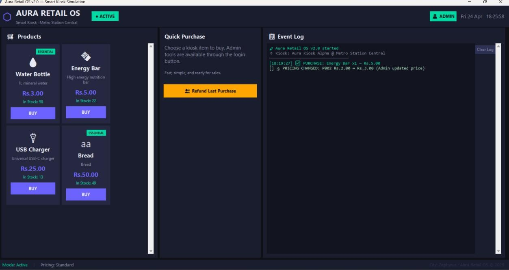 | 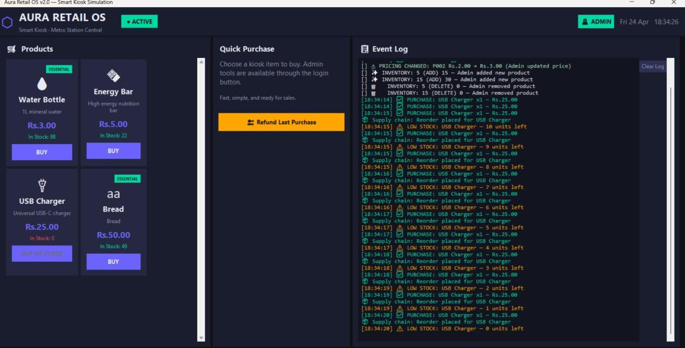 |

| Restock After Depletion | Discounted Pricing Mode |
|---|---|
| 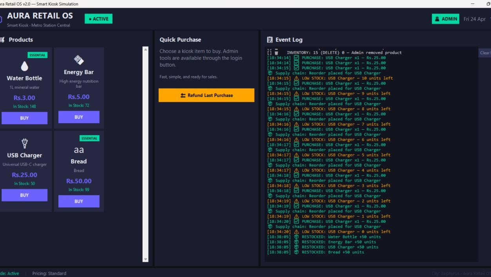 | 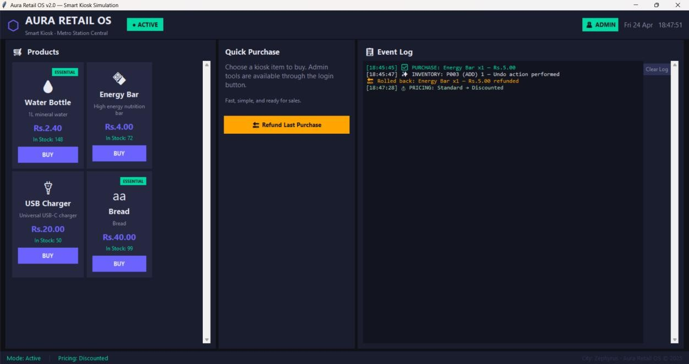 |

| Hardware Failure Logged |
|---|
| 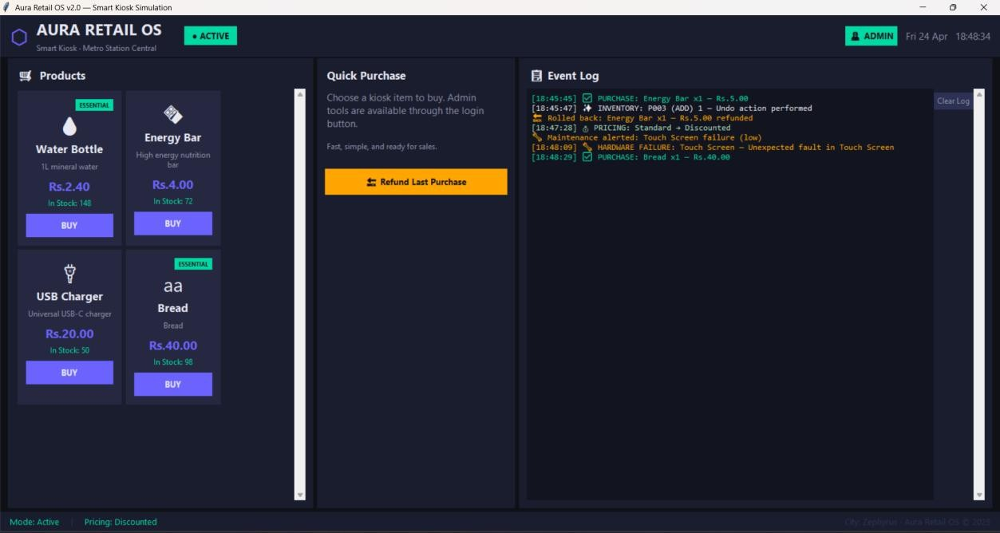 |

---

### 👨‍💼 Admin Control Panel
> Full inventory management, pricing strategy switching, kiosk mode controls, and live admin logs.

| Admin Panel — Initial State | After Purchase (Revenue Logged) |
|---|---|
| 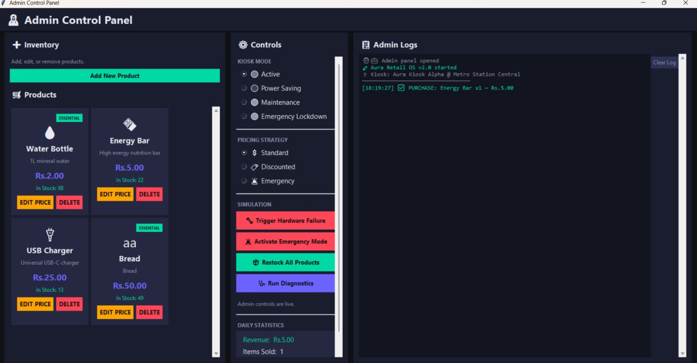 | 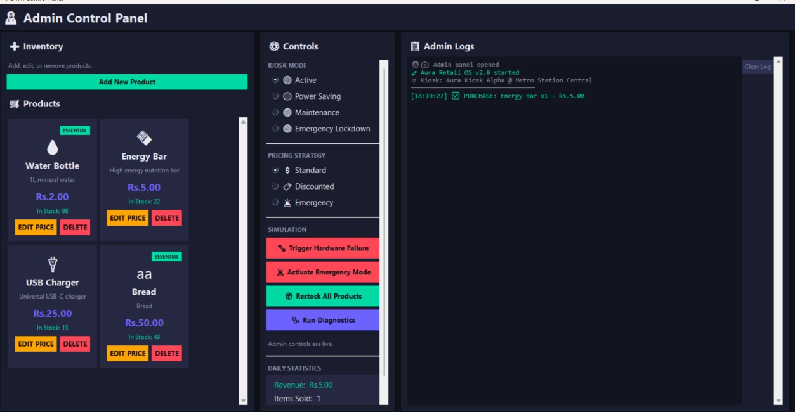 |

| Price Edit Reflected | Inventory Add & Delete Operations |
|---|---|
| 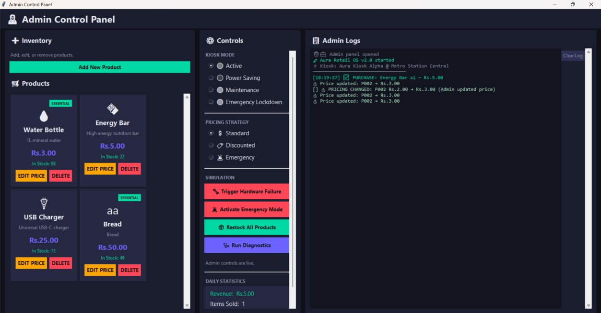 | 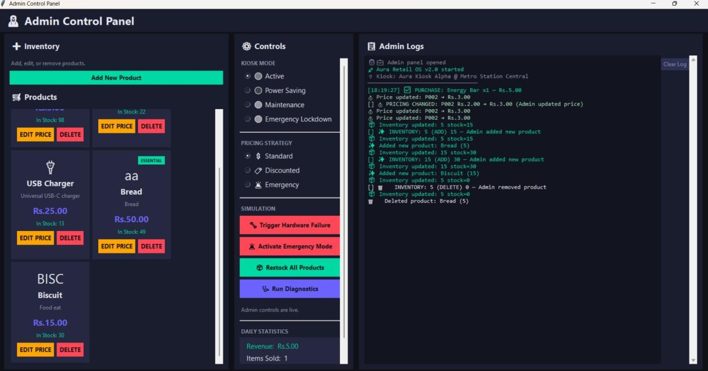 |

| Product Deletion Logged | Full Operation Log |
|---|---|
| 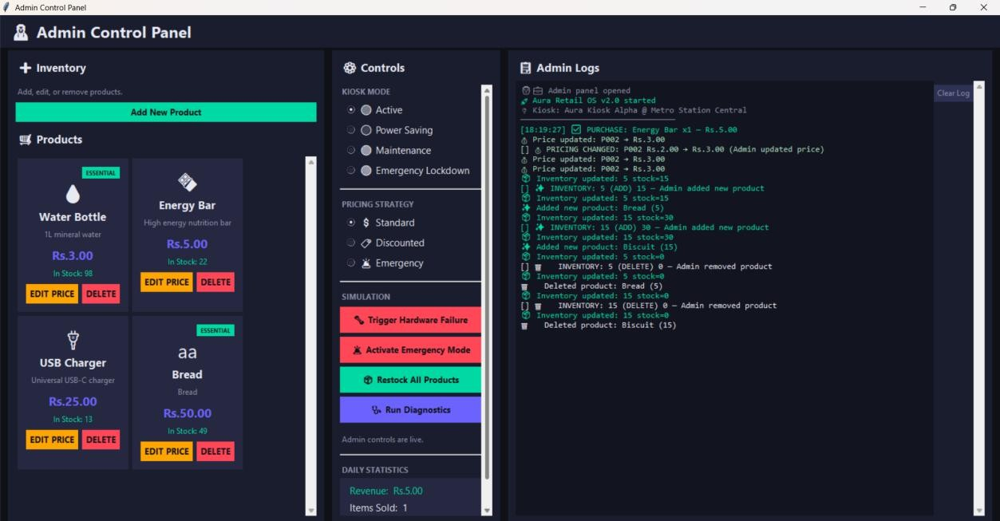 | 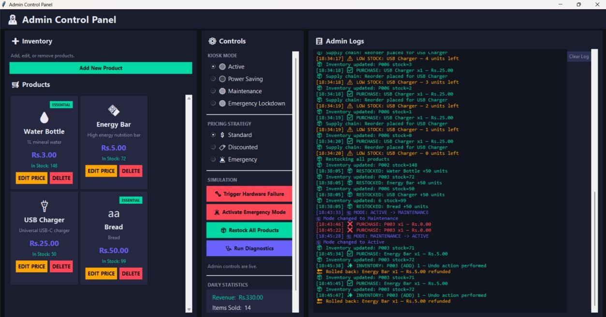 |

---

## ✨ Key Features

### 🎯 System Architecture
- **Kiosk Core System** with state management (Active/Maintenance/Emergency)
- **Inventory Management** with thread-safe concurrent operations
- **Payment Processing** using command pattern
- **Hardware Abstraction** with automatic failure recovery
- **City Monitoring** for real-time alerts

### 👨‍💼 Admin Panel
- ✅ Add new products dynamically
- ✅ Edit product prices (with real-time sync)
- ✅ Update inventory levels
- ✅ Delete products
- ✅ Password-protected login

### 🔄 Real-Time Features
- Live price updates to user interface
- Automatic stock synchronization
- Event-driven architecture
- Real-time event logging

### 🧵 Advanced Capabilities
- **Concurrent Transactions**: Prevents overselling with thread-safe operations
- **Event Priority System**: Emergency events override normal operations
- **Automatic Failure Recovery**: Retry → Recalibrate → Technician chain
- **Session Management**: 1-hour admin timeout

## 📊 Design Patterns (11 Total)

| # | Pattern | Location | Use Case |
|---|---------|----------|----------|
| 1 | Abstract Factory | `core/kiosk_factory.py` | Multiple kiosk types |
| 2 | Factory Method | `core/kiosk_factory.py` | Kiosk creation |
| 3 | Facade | `core/kiosk_interface.py` | Simplified API |
| 4 | Observer | `events/event_system.py` | Event broadcasting |
| 5 | State | `state/` | Mode management |
| 6 | Command | `transactions/` | Transaction execution |
| 7 | Memento | `transactions/transaction_memento.py` | Undo support |
| 8 | Chain of Responsibility | `hardware/` | Failure handling |
| 9 | Singleton | `admin/admin_authenticator.py` | Single instance |
| 10 | Decorator | `inventory/thread_safe_inventory.py` | Thread safety |
| 11 | Priority Queue | `events/event_priority.py` | Event ordering |

## 🔐 Admin Credentials

```
Username: admin
Password: admin123
```

⚠️ **Note**: In production, use environment variables and bcrypt hashing.

## 📁 Project Structure

```
Code_1/
├── main.py                    # Entry point with kiosk selection
├── IMPLEMENTATION_GUIDE.md    # Detailed feature documentation
│
├── admin/                     # Admin subsystem
│   ├── admin_authenticator.py # Password & session management
│   └── admin_manager.py       # Product/pricing operations
│
├── gui/                       # User interface
│   ├── app.py                 # Main application window
│   ├── admin_dialogs.py       # Login and control panel
│   ├── kiosk_selection.py     # Startup selector
│   └── styles.py              # Color/font definitions
│
├── core/                      # Core kiosk system
│   ├── kiosk.py               # Kiosk main logic
│   ├── kiosk_interface.py     # Facade for external use
│   ├── kiosk_factory.py       # Factory patterns
│   └── central_registry.py    # Singleton registry
│
├── events/                    # Event system
│   ├── event_system.py        # EventBus
│   ├── event_priority.py      # Priority queue
│   ├── events.py              # Event definitions
│   └── subscribers.py         # Event subscribers
│
├── inventory/                 # Inventory management
│   ├── inventory_manager.py   # Core inventory
│   └── thread_safe_inventory.py # Thread-safe wrapper
│
├── transactions/              # Transaction processing
│   ├── command.py             # Command base
│   ├── purchase_command.py    # Purchase logic
│   ├── restock_command.py     # Restock logic
│   └── transaction_memento.py # Undo support
│
├── state/                     # State management
│   ├── kiosk_state.py         # Base state
│   ├── active_state.py        # Active mode
│   ├── emergency_state.py     # Emergency lockdown
│   ├── maintenance_state.py   # Maintenance mode
│   └── power_saving_state.py  # Power saving mode
│
├── hardware/                  # Hardware layer
│   ├── failure_handler.py     # Base handler
│   ├── retry_handler.py       # Retry logic
│   ├── recalibration_handler.py # Recalibration
│   └── technician_handler.py  # Technician alerts
│
├── pricing/                   # Pricing strategies
│   ├── pricing_strategy.py    # Strategy base
│   ├── standard_pricing.py    # Normal pricing
│   ├── discounted_pricing.py  # Discounts
│   └── emergency_pricing.py   # Emergency markup
│
└── data/                      # Configuration
    ├── config.json            # System config
    ├── inventory.json         # Product inventory
    └── transactions.json      # Transaction log
```

## 🎮 Usage Examples

### Purchase an Item
```
1. Click on product card
2. Confirm purchase
3. Transaction logged in event log
4. Stock updated in real-time
```

### Admin Add Product
```
1. Click "👨‍💼 ADMIN" → Login
2. Fill "Add New Product" form:
   - Product ID: JUICE-001
   - Product Name: Orange Juice
   - Icon: 🧃
   - Base Price: 2.99
   - Quantity: 50
3. Click "Add Product"
4. Product appears for all users
```

### Admin Change Price
```
1. In Admin Panel → "Edit Products"
2. Select product from list
3. Modify price field
4. Click "Save Changes"
5. Users see new price instantly
```

### Test Emergency Mode
```
1. Control Panel → Pricing Strategy
2. Select "🚨 Emergency (+50%)"
3. or select "🔴 Emergency Lockdown" mode
4. Prices update, per-person limits apply
```

## 🧪 Testing Scenarios

### Concurrent Purchases
```python
# Multiple users purchase same item simultaneously
# Expected: Only available quantity is consumed
# Feature: ThreadSafeInventory prevents overselling
```

### Admin Changes During Shopping
```
# Admin adds product while user browsing
# Expected: User sees new product immediately
# Feature: Real-time EventBus synchronization
```

### Emergency Mode Priority
```
# System in normal mode
# Activate emergency → prices jump 50%
# Expected: Emergency event processed before normal purchases
# Feature: EventPriorityQueue ([CRITICAL] > [HIGH] > [MEDIUM] > [LOW])
```

### Hardware Failure Recovery
```
# Trigger failure from control panel
# Expected: Retry (3x) → Recalibrate → Technician Alert
# Feature: Chain of Responsibility pattern
```

## 📈 Event Priority Levels

```
Priority Distribution:
┌──────────────────────────────────────────┐
│ 🚨 CRITICAL [10] - EmergencyModeActivated│
├──────────────────────────────────────────┤
│ 🔧 HIGH [5]      - HardwareFailure       │
├──────────────────────────────────────────┤
│ 💰 MEDIUM [3]    - PricingChanged        │
├──────────────────────────────────────────┤
│ ✅ LOW [1]       - TransactionEvent      │
└──────────────────────────────────────────┘

Ensures: Emergencies are handled first
```

## 🔒 Thread Safety

All concurrent operations are protected:

```python
ThreadSafeInventory
├── Per-product locks (fine-grained)
├── Atomic reserve/deduct
└── Prevents race conditions

Guarantees:
✓ No overselling
✓ Consistent inventory
✓ Safe concurrent purchases
```

## 📝 Configuration Files

### `data/config.json`
System-wide configuration and settings

### `data/inventory.json`
Current product inventory and pricing

### `data/transactions.json`
Transaction history and logs

---

**Version**: 2.0  
**Last Updated**: 2025
